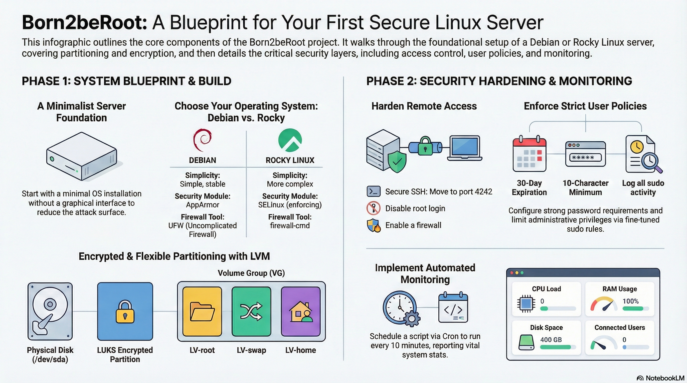

# Born2beroot

> A system administration project from the 42 curriculum focused on building a secure Linux server.



This infographic summarizes the global architecture and security principles implemented in this project.

```md
# Born2beroot

Born2beroot is a system administration project from the 42 curriculum.
The goal is to set up a secure Linux virtual machine following strict rules and best practices.
```

---

### 🖥️ Environment

```md
## Environment

- Operating System: Debian 12 (Bookworm)
- Virtualization: VirtualBox
- Architecture: amd64
- Package manager: apt
```

💡 À l’éval, **on te posera ces questions**. Ici, tu montres que tu assumes.

---

### 🔐 Security configuration

```md
## Security configuration

- SSH enabled on port 4242
- Root login via SSH disabled
- UFW firewall enabled
- Only port 4242 allowed
- Strong password policy enforced (PAM)
- sudo configured with restricted rules
```

👉 Tu montres la **logique sécurité**, pas les fichiers.

---

### 👤 Users and groups

```md
## Users and groups

- Main user created according to subject requirements
- User added to sudo and custom group
- Root access restricted
```

⚠️ Important : **login conforme au sujet**, pas décoratif.

---

### 📊 Monitoring script

```md
## Monitoring script

A bash script runs every 10 minutes using cron and displays system information with wall:
- CPU and memory usage
- Disk usage
- Network information
- Active users
```

💥 C’est un point-clé du projet.

---

### 📦 Submission

```md
## Submission

The only file submitted is `signature.txt`, containing the signature of the virtual disk.
```

---

### 🧠 Concepts learned (optionnel mais propre)

```md
## Concepts learned

- Linux system administration
- User and permission management
- Network security basics
- Automation with cron
```

## Visual overview

The infographic above provides a high-level view of the system design, security layers, and monitoring strategy implemented in this virtual machine.

---

